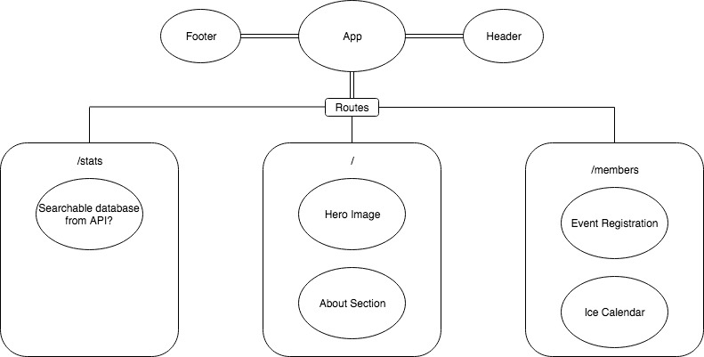

# _Evergreen Curling Club Website Redesign_

#### _Remaking Evergreen Curling Club's Website; 6-December-2019_

#### By _**Mike McShane**_

## Description

The site will allow members of the club to register for leagues, clinics, teams, as well as provide a calendar of events and other club-related news. So far, the site is just comprosed of static elements.

Friday Timeline:

8am-9am: Scaffold out project and add boilerplate code.
9am-10:30am: Build and style navbar and header apps.
10:30am-12pm: Watched React/Redux courses on Udemy and messed around with P5 example code to see if it's something I want to bring into my application (https://molleindustria.github.io/p5.play/).
1pm-3pm: Builted and worked on About Section on home page. Changed site color scheme. Removed white space between header and about components left over from using clip-path.
3pm-4pm: Reformat README and add visual layout to fit friday project's specifications.

## Features the project requires to meet this purpose or goal:

* Authentication so members can create an account and view the site.
* Ability for users to join and register for leagues/teams/bonspiels/etc.
* Advanced CSS styling - including responsive design and animations

## Tools, frameworks, libraries, APIs, modules and/or other resources needed to create MVP:
* React to create components, Redux to manage any state.
* App will be built using Node.js framework with webpack for bundling.
* @keyframes in CSS to handle animations.
* Authentication (using Firebase?)

## Stretch goals to add to project:

* A calendar where members can reserve practice ice time using a calendar interface
* A directory of all club members with contact information.
* A database of game results that members can log. A possible API might need to be built for this.
* A notification on the website when a livestream on youtube is currently being broadcasted.

## Component and Route Structure

## Support and contact details

mmcshane10@gmail.com

## Technologies Used

### License

*open source*

Copyright (c) 2019 **_Mike McShane_**